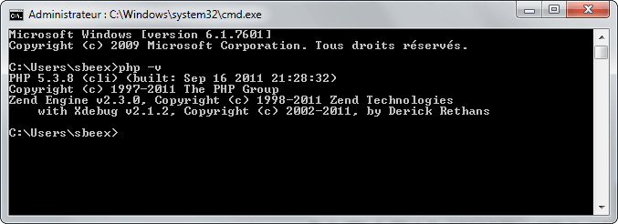
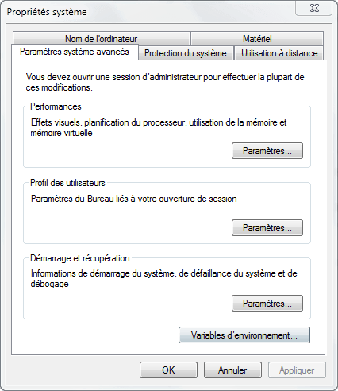
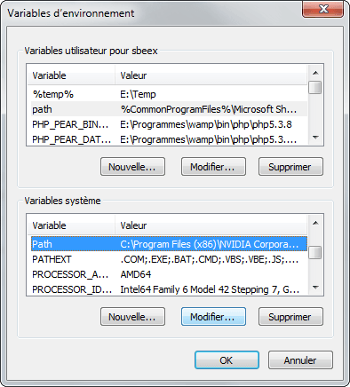
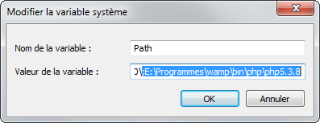

### Sommaire
{:.no_toc}

1. TOC
{:toc}

## Installation de WAMP

Pour commencer, il faut télécharger l’installeur wamp disponible gratuitement sur son [site officiel](http://www.wampserver.com/) dans la section 
**Télécharger**.

> Notez qu’il est disponible en version 32 et 64 bits veillez donc à choisir la bonne version en regard de votre système d’exploitation afin d’en tirer pleinement satisfaction

Dès lors que le téléchargement est terminé vous pouvez procéder à son installation. L’installation est très simple je ne m’attarderai pas dessus afin de rester centré uniquement sur l’essentiel dans ce tutoriel.

## Configuration de la variable d'environnement **PATH** pour PHP

Pour savoir si php est déjà enregistré dans le path de votre système lancez l’invité de commande (cmd) et tapez :

~~~
php -v
~~~

Si vous n’obtenez pas un message similaire à celui de l'image ci-dessous, ce qui suit vous concerne. Sinon passez directement à la prochaine étape.

> Notez que votre numéro de version risque d'être un peu plus récent que le mien.

Donc si vous n'obtenez pas ce message, rien de grave voici comment procéder :

## Modification de la variable d'environnement PATH

Rendez-vous dans **Panneau de configuration > Système > Paramètres système avancés** :

Cliquez sur le bouton **Variables d’environnement…** puis dans variables système sélectionnez la variable nommée **Path** :

Cliquez sur **Modifier…** Et ajouter la ligne de texte suivante (en adaptant le chemin à votre installation de wamp) à la fin de ce qui est déjà noté :

Attention au ; : Il ne faut pas l’oublier sinon vous risquez d’avoir des ennuis.

Fermez votre invité de commande windows si ce n’est déjà fait et lancez-le à nouveau.

Entrez la commande :
~~~
php -v
~~~

Vous devriez obtenir cette fois-ci un résultat proche de celui de l’image console précédente.

Si cela ne fonctionne pas vérifiez que vous avez renseigné le bon chemin pour votre exécutable php.

## Déploiement des différents modules Apache et PHP recommandés par la doc de Symfony2

## Pour apache

Faites clic-gauche sur l’icône de Wamp dans la barre des tâches > Apache > Apache Modules > sélectionnez **Rewrite Module**

## Pour les modules php

Faites clic-gauche sur l’icône de Wamp > PHP > PHP Extensions > cochez **php_intl, php_xmlrpc, php_pdo_mysql, php_sqlite3, php_mbstring**

Symfony2 recommande également l’utilisation du module **php_apc** pour accélérer le rendu des pages mais **je vous le déconseille pour l’environnement de développement** car il pose quelques problèmes avec phpmyadmin et je ne traiterai pas de la cohabitation entre apc et pma ici. (Peut-être dans un article future)

## Test de Symfony2

Pour vérifier que tout est en ordre, je vous invite à télécharger le framework Symfony2 sur son [site officiel]
(http://www.symfony.com/).

Placez ensuite le répertoire Symfony dans votre répertoire web (par défaut **C:/WAMP/www/** ) et rendez-vous à 
l’adresse : [http://localhost/Symfony/app/check.php](http://localhost/Symfony/app/check.php)

Si Symfony2 ne vous donne pas de recommandations, c’est que vous êtes prêt à déployer des pojets avec symfony2 !

Dans le cas contraire je vous invite à relire le tutoriel afin de vérifier que vous n’ayez rien oublié et à me contacter si j’ai omis quelque chose dans ce tuto.

N’hésitez-pas à poser une question si besoin je vous y répondrai dès que possible ;) Bon code !

