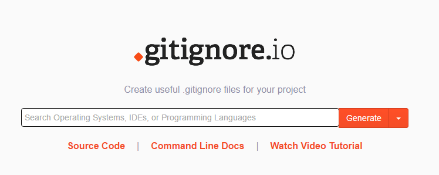

Aujourd’hui je partage ici une petite trouvaille qui me simplifie grandement la vie et qui devrait vous intéresser aussi si vous êtes ici.

Quand on stock un projet sur Git il arrive fréquemment qu'on se retrouve avec des fichiers propres à l’IDE utilisé ou encore de bons vieux fichiers .thumbs de windows ou autre selon l’OS. La cause ? Un .gitignore incomplet.

Gitignore.io - Une solution communautaire
------------------------------------------
Ce superbe outil baptisé [gitignore.io](https://www.gitignore.io/) crée par Joe Blau est hébergé sur Github. Les pull requests sont possibles et 
donc les développeurs peuvent l'améliorer en continue. Mis à jour par des développeurs pour les développeurs :

Comment l'utiliser
------------------
Ce site vous permet tout simplement de saisir via des mots-clés les différentes choses que vous souhaitez exclure.

Prenons l'exemple d'un projet Java: Il existe plusieurs IDE qui vont créer leurs petits fichiers comme Eclipse, NetBeans, IntelliJ de JetBrains, etc.

Voici a quoi pourrait ressembler notre liste d'exclusion :

Avec ces 4 mots-clés nous avons rejeté tous les fichiers spécifiques aux IDE eclipse, intelliJ, et NetBeans + les fichiers java inutiles (.class par exemple).

Il suffit ensuite de cliquer sur le bouton Generate et voici ce qu’on obtient :

~~~
# Created by https://www.gitignore.io/api/eclipse,java,jetbrains,netbeans

### Eclipse ###

.metadata
bin/
tmp/
*.tmp
*.bak
*.swp
*~.nib
local.properties
.settings/
.loadpath
.recommenders

# Eclipse Core
.project

# External tool builders
.externalToolBuilders/

# Locally stored "Eclipse launch configurations"
*.launch

# PyDev specific (Python IDE for Eclipse)
*.pydevproject

# CDT-specific (C/C++ Development Tooling)
.cproject

# JDT-specific (Eclipse Java Development Tools)
.classpath

# Java annotation processor (APT)
.factorypath

# PDT-specific (PHP Development Tools)
.buildpath

# sbteclipse plugin
.target

# Tern plugin
.tern-project

# TeXlipse plugin
.texlipse

# STS (Spring Tool Suite)
.springBeans

# Code Recommenders
.recommenders/

### JetBrains ###
# Covers JetBrains IDEs: IntelliJ, RubyMine, PhpStorm, AppCode, PyCharm, CLion, Android Studio and Webstorm
# Reference: https://intellij-support.jetbrains.com/hc/en-us/articles/206544839

# User-specific stuff:
.idea/workspace.xml
.idea/tasks.xml
.idea/dictionaries
.idea/vcs.xml
.idea/jsLibraryMappings.xml

# Sensitive or high-churn files:
.idea/dataSources.ids
.idea/dataSources.xml
.idea/dataSources.local.xml
.idea/sqlDataSources.xml
.idea/dynamic.xml
.idea/uiDesigner.xml

# Gradle:
.idea/gradle.xml
.idea/libraries

# Mongo Explorer plugin:
.idea/mongoSettings.xml

## File-based project format:
*.iws

## Plugin-specific files:

# IntelliJ
/out/

# mpeltonen/sbt-idea plugin
.idea_modules/

# JIRA plugin
atlassian-ide-plugin.xml

# Crashlytics plugin (for Android Studio and IntelliJ)
com_crashlytics_export_strings.xml
crashlytics.properties
crashlytics-build.properties
fabric.properties

### JetBrains Patch ###
# Comment Reason: https://github.com/joeblau/gitignore.io/issues/186#issuecomment-215987721

# *.iml
# modules.xml
# .idea/misc.xml 
# *.ipr

### NetBeans ###
nbproject/private/
build/
nbbuild/
dist/
nbdist/
nbactions.xml
.nb-gradle/

### Java ###
*.class

# Mobile Tools for Java (J2ME)
.mtj.tmp/

# Package Files #
*.jar
*.war
*.ear

# virtual machine crash logs, see http://www.java.com/en/download/help/error_hotspot.xml
hs_err_pid*
~~~

Voili voila !