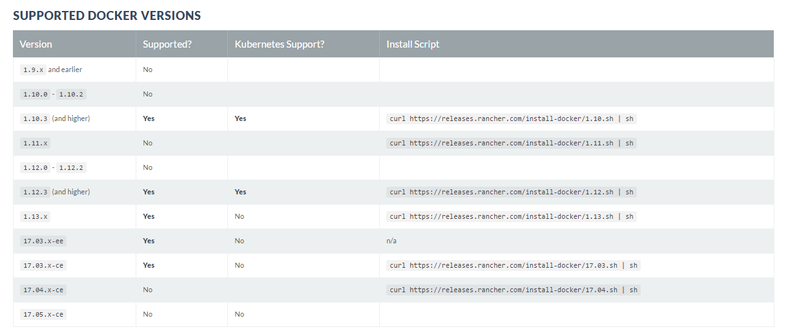

Si comme moi vous avez naivement installé docker en dernière version (oui ça arrive :sweat_smile:) vous souhaiterez peut-être 
installer une version plus stable. Dans mon cas Rancher ne supporte pas encore la toute dernière version de docker. 
J'ai donc du downgradé ma version pour une version antérieure compatible.

Il existe certainement d'autres façon de le faire mais dans mon cas voici une solution drastique qui fonctionne:

1) On désinstalle docker:
~~~
sudo apt-get purge docker-engine
sudo apt-get autoremove --purge docker-engine
rm -rf /var/lib/docker # attention cette ligne va supprimer toutes les images, containers, et volumes
~~~

2) Installation de docker à la version souhaitée:

Je vous propose d'utiliser les scripts fournis par rancher: 

http://docs.rancher.com/rancher/v1.6/en/hosts/#supported-docker-versions

Ce qui nous donne pour la version 17.03.x-ce par exemple:

~~~
curl https://releases.rancher.com/install-docker/17.03.sh | sh
~~~

Et voila !