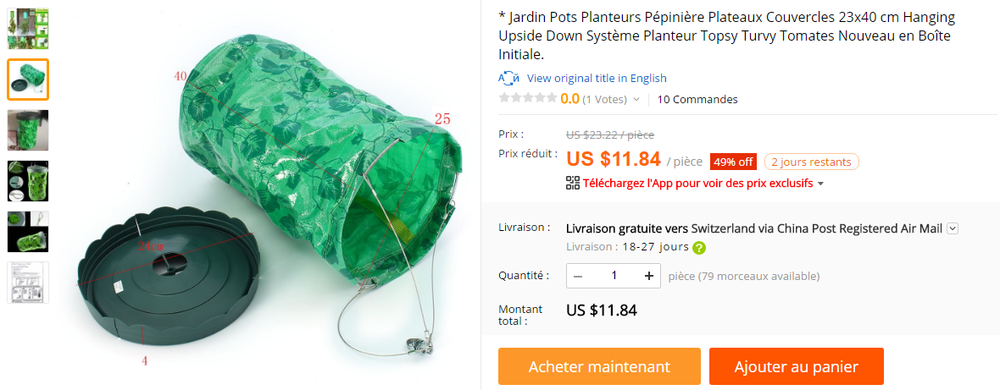
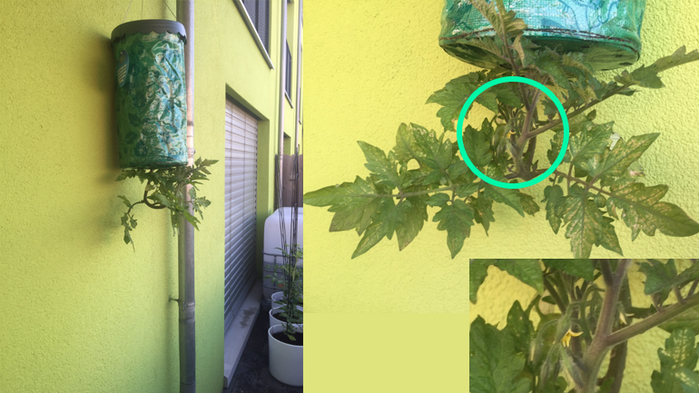

## Ma life
Pour des raisons professionnelles j'ai été contraint de déménager en ville et j'ai rapidement ressenti un manque de verdure. (Et oui ... )

Donc j'ai commencé par des tomates car j'adore les tomates ! Et la récolte a été fabuleuse. Je n'ai pas pesé mais on en a eu plusieurs kg je pense.
Par contre, les tomates ça grimpe ça grimpe et il faut les attacher à un tuteur etc.

Du coup j'ai cherché sur le net et j'ai trouvé un autre système de culture sans tuteur ! Pas mal hein ?

## La culture verticale
En fait l'idée est toute bête on plante le plant de tomate à l'envers. La nature étant bien faite le plant va se redresser et du coup plus besoin de tuteur la gravité et la nature s'occupent de tout :

Donc j'ai acheté un kit pour **12$** sur aliexpress pour commencer:

Il y a de nombreux vendeurs faites une recherche avec : "**Upside Down tomato**".

Ensuite c'est très simple tout est fourni il vous faut simplement acheter un plant de tomate (ou faites germer une graine) et ensuite lire la notice tout y est expliqué.

Le top la dedans c'est que les tomates sont toujours hydratées car l'eau qui tenterait de s'évaporer retombera sous forme de goutelettes grâce au couvercle sur le dessus du pot. Le surplus d'eau lui coulera automatiquement en dessous.

En ce qui me concerne, le plant de tomates à bien pris et nous avons la chance d'avoir déjà des fleurs :

Bienne, 15 main 2017

On verra ce que ça donne mais ça s'annonce plutôt bien !