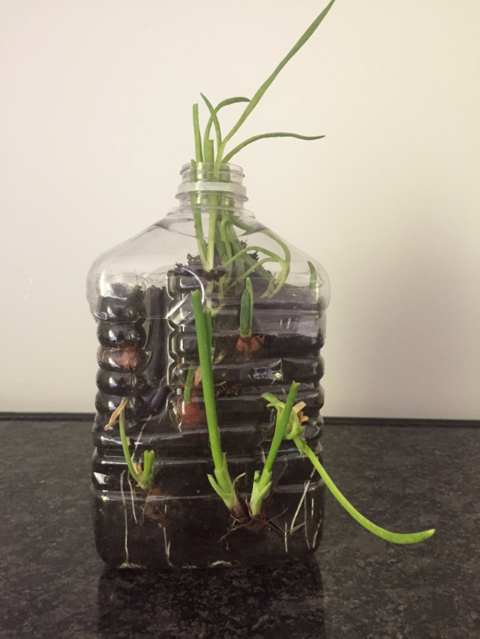
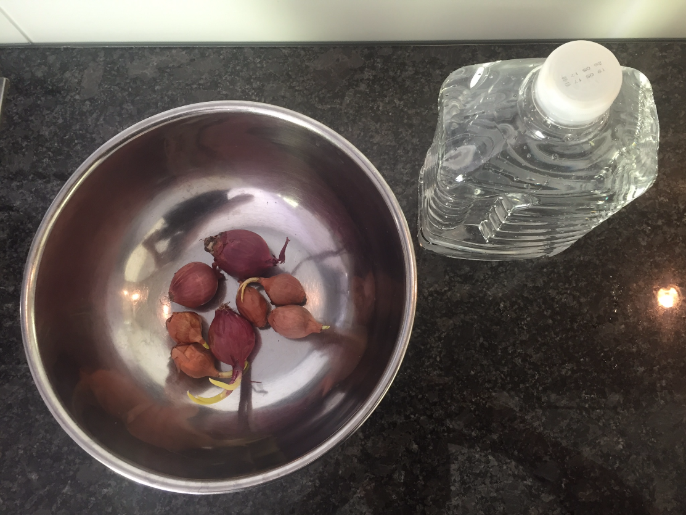
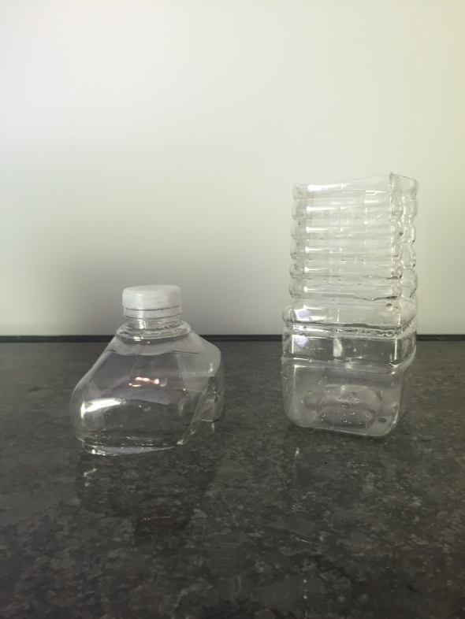
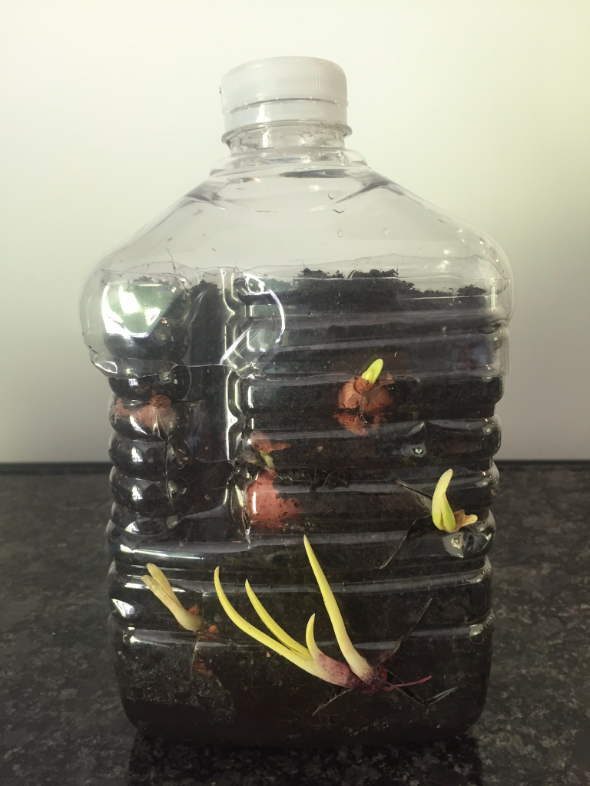

## Ah les oignons...
Les oignons et moi c'est une grande histoire d'amour: la sauce aux oignons, les oignons grillés sur le BBQ, sans parler qu'en cuisine c'est pratiquement un légume indispensable !

Mais voilà... il arrive qu'on n'ait pas eu le temps de tous les manger avant qu'ils germent. :confused:

## Comment réutiliser ces oignons ?
On va laisser germer l'oignon et manger le germe en tant qu' "aromate". Exactement comme on le ferait avec de la ciboulette. 

On peut s'en servir :
* pour assaisonner la salade (avantage, on évite l'effet mauvaise haleine qu'on aurait eu avec un oignon frais coupé)
* coupé finement dans une pâte à crèpes (si vous faites des crèpes salés au jambon par exemple)

### Résultat

(comme on peut le voir, j'ai déjà été récolter quelques fois)

L'idée n'est pas de moi c'est un phénomène très actuel qui traine sur le web. J'ai donc suivi [ce tutoriel vidéo youtube](https://www.youtube.com/watch?v=9VCWGHfE80c&t=1s) et je l'ai adapté avec ce que j'avais sous la main.

### Le matériel nécessaire:
* Des oignons germés (ou pas germés ça ira aussi !)
* Une bouteille en PET assez grande

_Pour les Suisses, je vous conseille les bouteilles de jus d'orange Ana's Best vendues chez Migros. Elles sont bien robustes et de taille moyenne._

### Instructions

Pour commencer, il va falloir laver puis découper la bouteille comme ceci:

On obtiendra alors un couvercle (la partie avec le bouchon) et un récipient.

Remplissez le récipient de terreau.

Faites des entailles en X ou en Y si vous êtes plus habile afin de pouvoir glisser vos oignons directement à l'intérieur de la bouteille.

Note: Par la suite, j'ai retiré le couvercle et j'ai placé des oignons tout en haut de la terre pour encore optimiser l'espace.

Voilà maintenant vous ne jetterez plus vos oignons germés !
